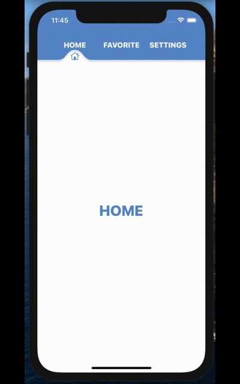

# SwiftUI でカスタムShapeを利用してタブメニューを作ってみる

## 完成形

こんな感じのタブメニューを作る

## 参考

- カスタムPath
  - [【SwiftUI】Pathを使った図形の描画](https://capibara1969.com/2723/)
- ベジェ曲線のひき方
  - [Apple公式ドキュメント](https://developer.apple.com/documentation/uikit/uibezierpath/1624357-addcurve)
  - [SwiftUIのビューサイズにあわせてPathを表示する](https://note.com/kaigian/n/ncaab1ee5af1b#APUHV)
- シェイプのアニメーション
  - [Qiita](https://qiita.com/takehito-koshimizu/items/786dac0741e19552907b)
- アイデア参考
  - [SwiftUI Complex UI - Food App UI - Side Tab Bar - Complex Smooth Curves - SwiftUI 2.0 Tutorials](https://www.youtube.com/watch?v=ZJrKj-HW6ss&t=271s)